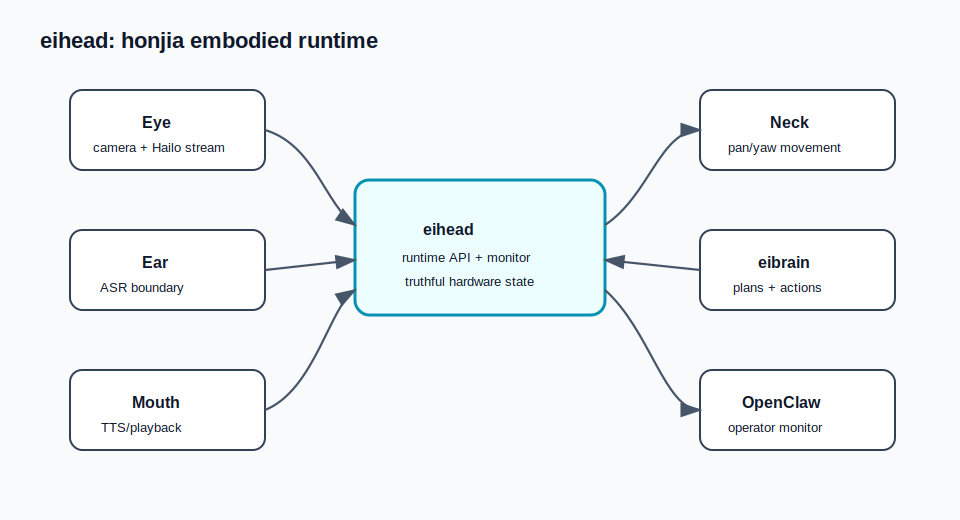

# eihead

Canonical honjia head runtime package for the ei-hongtu project.



## EI Series Role

`eihead` is the embodied runtime layer of the EI series. It owns the honjia head
surface: realtime vision, audio input, speech playback, neck movement, monitor
payloads, and local runtime APIs.

It is separate from `eibrain` by design. `eibrain` decides what should happen;
`eihead` reports what the head can observe and executes bounded head/body
actions through explicit runtime endpoints and protocol events.

## What It Is For

`eihead` provides the physical or quasi-physical interface for EI deployments:

- eye: camera/Hailo realtime observations and scene payloads
- ear: realtime or quasi-streaming ASR boundaries
- mouth: playback and TTS integration boundaries
- neck: pan/yaw movement and monitor state
- monitor: truthful status surfaces for operators
- runtime API: HTTP/CLI entrypoints for status, probes, and action dispatch

The package is meant to be deployed to honjia and monitored remotely from
honxin/OpenClaw.

## Truthful Runtime Rule

`eihead` must never fake completion. If a stage is not wired, not hardware
verified, blocked, or degraded, the API and monitor must say so explicitly.
Static fixtures and offline diagnostics are useful for development, but they
are not proof of live hardware cutover.

`eihead` is the canonical honjia head runtime package. It depends on
standalone `eiprotocol` for shared event contracts and does not vendor
`eibrain`.

## Expected sync target

- Source of truth on honxin: `/dev-project/eihead`
- Runtime deployment path on honjia: `/opt/eihead/current`
- Runtime API: `eihead-runtime http --host 0.0.0.0 --port 18081`
- Native Web monitor: `eihead-runtime monitor --host 0.0.0.0 --port 18080`

## Eye direction

The production eye target for `/dev-project/eihead` is realtime stream detection:
continuous `/dev/video0` camera frames and `/dev/hailo0` detections feeding live
RealtimeVisionObservation payloads, runtime status, and the operator monitor.

The native voice boundary is under `eihead/ear` and `eihead/mouth`:
`eihead/ear/realtime.py`, `eihead/ear/__init__.py`,
`eihead/mouth/playback.py`, and `eihead/mouth/__init__.py`.
Its monitor adapter is `eihead/monitoring/voice.py`.
The monitor endpoint bridge is exported in `eihead/monitoring/web.py`, with
runtime facade support in `eihead/runtime/app.py`.

Native runtime and monitor surface includes:
- `GET /api/voice/realtime`
- `GET /api/audio/realtime`

Voice chain is now in a scheduler-backed functional stage using Realtime
Cognitive Scheduler for round lifecycle, scheduler status, and interrupt
visibility. It provides functional offline/quasi-streaming diagnostics for the
closed-loop voice diagnostics surface, but it is not hardware-verified real
streaming.
The closed-loop voice diagnostics are functional offline/quasi-streaming diagnostics,
not hardware-verified real streaming or real streaming LLM/TTS.
It is still functional-not-complete: the loop has not been wired to real
streaming LLM/TTS, and the Web monitor should make round/scheduler/interrupt
state visible without presenting missing streaming stages as complete.

## Code completion vs cutover

Code-level completion is not honjia cutover completion. In
`EXPORT_MANIFEST.json`, `cutover_readiness.honjia_cutover` is
`blocked_by_hardware_validation` and `cutover_readiness.hardware_verified` is
`false`.

The export is split from legacy packages and does not vendor `eibrain`.
Real cutover still requires honjia parity for eye, pan-only neck, ear/mouth
audio, service startup, reboot persistence, and rollback.

The standalone export intentionally includes the native realtime eye adapter and
monitor payload files:

- `eihead/eye/adapters.py`
- `eihead/eye/gstreamer.py`
- `eihead/eye/hailo_metadata.py`
- `eihead/eye/realtime.py`
- `eihead/monitoring/realtime_vision.py`

Native voice boundaries are exported as:

- `eihead/ear/__init__.py`
- `eihead/ear/realtime.py`
- `eihead/mouth/__init__.py`
- `eihead/mouth/playback.py`
- `eihead/monitoring/voice.py`
- `eihead/runtime/http_api.py`
- `eihead/monitoring/web.py`

The monitor truthfulness rule is strict: missing live wiring must be shown as
`not wired`, `not_wired`, `unknown`, or explicit offline/degraded data. Do not
show blank or fake-normal realtime vision status.

Static image detection is compatibility/test-only. Keep it only for old callers,
fixtures, and non-hardware tests; do not treat it as the deployment direction.

## Local commands

```bash
python -m pip install -e .
eihead-runtime status
eihead-runtime http --host 0.0.0.0 --port 18081
eihead-runtime monitor --host 0.0.0.0 --port 18080
```

`eihead` consumes `eiprotocol` as a standalone dependency. Install both from
the parent workspace during development:

```bash
python -m pip install -e D:/github/ei-workspace/repos/eiprotocol
python -m pip install -e D:/github/ei-workspace/repos/eihead
```

`EXPORT_MANIFEST.json` is the source of truth for whether eye, neck, ear,
mouth, runtime, export, and deploy are complete. A module remains blocked until
its gate is verified on honjia; status and monitor payloads must say
`not_wired`, `unknown`, `degraded`, or `blocked` rather than implying fake
completion.

## Cutover readiness and fake completion

`EXPORT_MANIFEST.json` contains `cutover_readiness`, a machine-readable summary
for cutover review. It lists readiness fields and boundaries so reviewers can
tell native ownership from runtime status.

How to judge fake completion:
- If `cutover_readiness.hardware_verified` is `false`, the hardware has not been verified on honjia and the export remains blocked/transitional even if local tests or static fixtures pass.
- If `cutover_readiness.legacy_body_runtime_detached` is `false`, the export
  is still awaiting legacy boundary removal and should remain blocked.
- Monitor endpoints are readiness probes, not proof of completion. A response
  is only acceptable when it shows real data or explicit `not_wired`, `unknown`,
  `degraded`, or `blocked` state for missing hardware or unwired stages.
